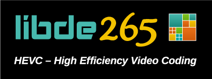

libde265 - open h.265 codec implementation
==========================================

libde265 is an open source implementation of the h.265 video codec.
It is written from scratch in plain C for simplicity and efficiency.
Its simple API makes it easy to integrate it into other software.

libde265 supports WPP and tile-based multithreading and includes SSE optimizations.
All features of the Main profile except long-term MC (which is currently unused
by the available encoders) are supported.

For latest news check our website at http://www.libde265.org

The library comes with two example programs:

- dec265, a simple player for raw h.265 bitstreams.
          It serves nicely as an example program how to use libde265.

- sherlock265, a Qt-based video player with the additional capability
          to overlay some graphical representations of the h.265
          bitstream (like CU-trees, intra-prediction modes).

Example bitstreams can be found, e.g., at this site:
  ftp://ftp.kw.bbc.co.uk/hevc/hm-10.1-anchors/bitstreams/ra_main/

Approximate performance for WPP, non-tiles streams (measured using the totem video
player with libde265-gstreamer plugin on a Intel(R) Core(TM) i7-2700K CPU @ 3.50GHz with
8 CPU cores on Ubuntu 12.04, 64bit):

| Resolution        | fps     | CPU usage @ 24 fps |
| ----------------- | ------- | ------------------ |
| 720p              | 685 fps | ~28 %              |
| 1080p             | 240 fps | ~80 %              |
| 4K                | 51 fps  | ~380 %             |

Building
========

If you got libde265 from the git repository, you will first need to run
the included `autogen.sh` script to generate the `configure` script.

libde265 has no dependencies on other libraries, but both optional example programs
have dependencies on:

- SDL (optional for dec265's YUV overlay output),

- Qt (required for sherlock265),

- libvideogfx (required for sherlock265, optional for dec265).

Libvideogfx can be obtained from
  http://www.dirk-farin.net/software/libvideogfx/index.html
or
  http://github.com/farindk/libvideogfx

You can disable building of the example programs by running `./configure` with
<pre>
  --disable-dec265        Do not dec265 decoder program.
  --disable-sherlock265   Do not build sherlock265 visual inspection program.
</pre>

Additional logging information can be turned on and off using these `./configure` flags:
<pre>
  --enable-log-error      turn on logging at error level (default=yes)
  --enable-log-info       turn on logging at info level (default=no)
  --enable-log-trace      turn on logging at trace level (default=no)
</pre>

Prebuilt binaries
=================

Binary packages can be obtained from this [launchpad site](https://launchpad.net/~strukturag/+archive/libde265).

Software using libde265
=======================

Libde265 has been integrated into these applications:

- gstreamer plugin, [source](https://github.com/strukturag/gstreamer-libde265), [binary packages](https://launchpad.net/~strukturag/+archive/libde265).

- Windows DirectShow filters, https://github.com/strukturag/LAVFilters/releases

- ffmpeg fork, https://github.com/farindk/ffmpeg

License
=======

libde265 is distributed under the terms of the GNU Lesser General Public License.
See COPYRIGHT for more details.

Copyright (c) 2013-2014 Struktur AG
Contact: Dirk Farin <farin@struktur.de>
